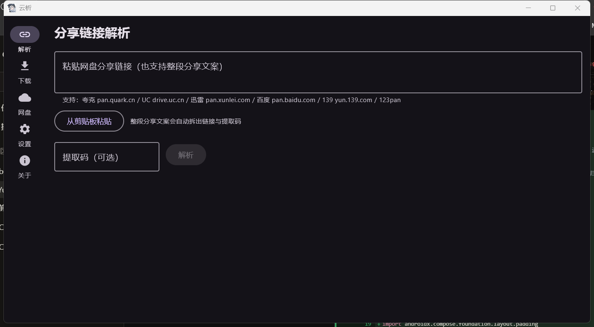
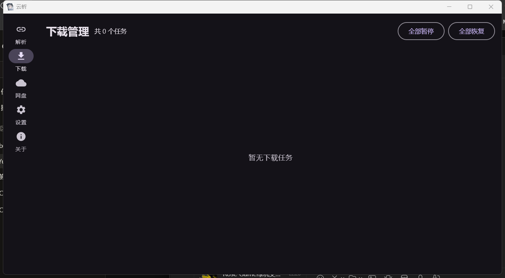
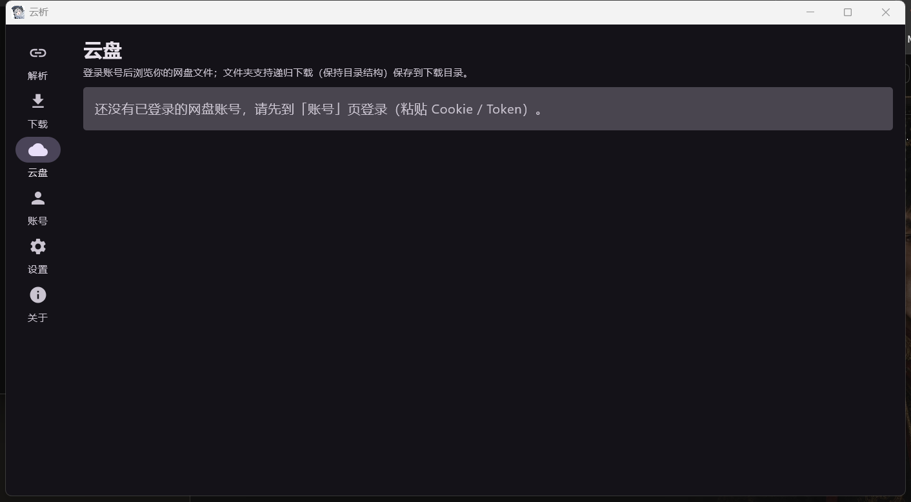
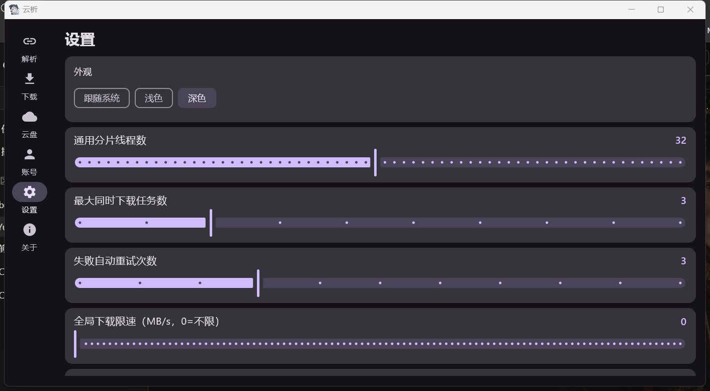
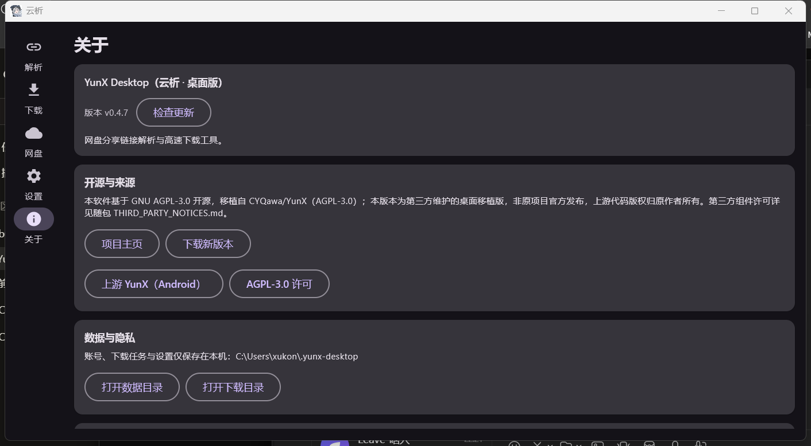

# YunX Desktop（云析桌面版）

网盘分享链接解析与高速下载的 Windows 桌面应用。粘贴分享链接，就能浏览分享内容并直接下载文件。

## 支持平台

**不建议用百度网盘，可能导致账号被风控！！！**

- 夸克网盘
- UC 网盘
- 迅雷网盘
- 百度网盘
- 139 网盘（和彩云）
- 123 云盘

## 功能

- **分享链接解析**：识别夸克 / UC / 迅雷 / 百度 / 139 / 123 的分享链接并自动匹配提取码；也可直接粘贴**整段分享文案**（自动拆出链接与提取码），或从剪贴板一键粘贴
- **高速下载**：多线程分片并发 + 断点续传 + HLS(m3u8) 下载，线程数与全局限速可调
- **文件浏览**：解析后浏览分享目录、进入子文件夹，点击文件即取直链下载
- **云盘浏览**：登录账号后浏览个人网盘（根 / 子目录、面包屑），支持**文件夹递归下载（保持目录结构）**
- **登录**：网页登录（调用本机已安装的浏览器，自动识别登录态）/ 手动粘贴 Cookie、JWT / 迅雷短信验证码登录
- **下载管理**：暂停 / 继续 / 删除 / 失败自动重试 / 多任务队列
- **界面**：侧边导航 + 页面切换动画；主题跟随系统 / 浅色 / 深色；记住上次页面与窗口尺寸

## 截图

| 分享链接解析 | 下载管理 | 网盘与登录 |
|:---:|:---:|:---:|
|  |  |  |

| 设置 | 关于 |
|:---:|:---:|
|  |  |

## 使用

1. 在「网盘」页的卡片上点「网页登录」登录网盘（登录完成后按提示点「保存并关闭」），再点卡片进入该网盘浏览文件
2. 在「解析」页粘贴分享链接（可带提取码），或直接粘贴整段分享文案
3. 浏览分享内容，点击文件获取下载直链
4. 「下载」页查看进度，支持暂停 / 继续 / 删除 / 打开目录

## 下载

到 [Releases](https://github.com/Floliam675/YunX-Desktop/releases) 下载（两种发行版内容完全相同，任选其一）：

| 版本 | 文件 | 说明 |
| --- | --- | --- |
| **安装版**（推荐） | `YunX-Desktop-<版本>-win64-installer.exe` | 双击安装：可选安装目录，默认按用户装到 `%LOCALAPPDATA%\YunX Desktop`，在开始菜单创建快捷方式，可从「应用和功能」正常卸载。静默安装加 `/quiet` |
| 免安装版 | `YunX-Desktop-<版本>-win64-portable.exe` | 免安装：双击后选择目录解压（7z 自解压，无需装解压软件），再运行 `YunX Desktop\YunX Desktop.exe` |

系统要求：Windows 10 / 11（x64）。两种版本都**内置 Java 运行时，无需另行安装 Java**。

## 技术栈

- Kotlin 2.2
- Compose Multiplatform Desktop 1.8.2 + Material 3
- OkHttp（网络请求 + 分片下载）
- 网页登录：驱动本机已安装的浏览器（Chromium 系走 DevTools Protocol，Firefox 走 WebDriver BiDi），**不随包分发浏览器内核**
- 持久化：JSON 文件（账号 / 下载任务 / 设置）+ AES-GCM 密钥文件（凭据）
- 交付打包：jpackage 出 app-image，便携版用 7z 自解压（LZMA2），安装版用 Inno Setup（LZMA2 solid）

## 构建

要求：JDK 17+；若要打 **exe 安装器**，还需 [WiX Toolset 3.14](https://github.com/wixtoolset/wix3/releases) 在 `PATH` 中。

```powershell
.\gradlew.bat :desktop:run                    # 直接运行
.\gradlew.bat :core:test                      # 单元测试
.\gradlew.bat :desktop:createDistributable    # 生成免安装目录（app-image）
```

## 常见问题

本程序**没有数字签名**，Windows 可能拦截：

| 提示 | 能否继续运行 | 处理办法 |
| --- | --- | --- |
| **SmartScreen**：「Windows 已保护你的电脑」 | 可以 | 点「更多信息」→「仍要运行」 |
| **智能应用控制**：「已阻止可能不安全的应用」 | **不行**（无“仍要运行”按钮） | 见下方三步 |

1. **双击 `Start-YunX.bat`**（推荐、零安装）：包内自带你所需的 JRE，并附带一个由 Java 厂商**数字签名**的启动器，脚本用它启动同一程序，被执行的是已签名程序；
2. **自己关闭智能应用控制**：设置 → 隐私和安全性 → Windows 安全中心 → 应用和浏览器控制 → 智能应用控制 → 关闭；
3. **等待签名版**：需作者取得代码签名证书后重新发布。

## 数据与隐私

| 内容 | 位置 |
| --- | --- |
| 账号、下载任务与设置 | `%USERPROFILE%\.yunx-desktop` |
| 下载的文件 | 设置页配置的下载目录 |

- 所有数据仅保存在本机，不上传任何服务器。
- 卸载程序只会移除安装目录，**不会**自动删除这些数据。

## 免责声明

本项目仅供个人学习与技术交流，请遵守各网盘平台的服务条款，并自行承担使用风险。下载内容版权归原作者所有，请在下载后 24 小时内删除。

## 开源协议

本项目基于 [GNU AGPL-3.0](https://www.gnu.org/licenses/agpl-3.0.html) 开源，移植自 [CYQawa/YunX](https://github.com/CYQawa/YunX)（Android 版，AGPL-3.0）；
本版本为**第三方维护的桌面移植版**，非原项目官方发布。详见根目录 [LICENSE](./LICENSE)，第三方组件许可见 [THIRD_PARTY_NOTICES.md](./THIRD_PARTY_NOTICES.md)。

## 关于协议逆向

本项目复用的网盘协议、分享解析与下载引擎逻辑来自上游 YunX（基于抓包分析与开源项目研究），接口可能随官方调整而失效，请以实际运行结果为准。网页登录只调用官方网页版，**不绕过验证码、风控与访问控制**。

## AI 生成声明

本项目的**桌面移植工程**（YunX Desktop）由维护者提出需求并负责验证，在 **AI 编码助手 DeepSeek v4 Flash（deepseek-v4-flash）** 的辅助下开发：

- 工程搭建、Compose Multiplatform 界面、解析/下载/云盘/账号流程整合、网页登录（借用本机 Edge / CDP）
  实现、Windows 打包与大量调试修复工作，主要由 AI 生成候选代码，经维护者审查、测试验证后合入；
  维护者负责需求定义、测试、打包与发布。
- **上游归属不受影响**：本项目复用的网盘协议、分享解析与下载引擎逻辑源自
  [CYQawa/YunX](https://github.com/CYQawa/YunX)（Android 版，AGPL-3.0），
  其版权与署名归原作者所有，详见 [PORTING.md](./PORTING.md)；本声明不覆盖、不减损上游作者的权利。
- **许可一致**：AI 生成或辅助修改的代码与全仓库一致，均以 GNU AGPL-3.0 发布，不额外主张版权；
  任何修改与再分发请遵守 [LICENSE](./LICENSE)。
- **质量与责任**：AI 生成代码可能含有缺陷或安全隐患，欢迎通过 Issues / Pull Requests 审查指正；
  使用者请自行评估并承担风险（另见下方免责声明）。
- **所用 AI**：DeepSeek v4.1 Flash（deepseek-v4.1-flash）——DeepSeek 出品的大语言模型，用于代码生成、重构与排错。

